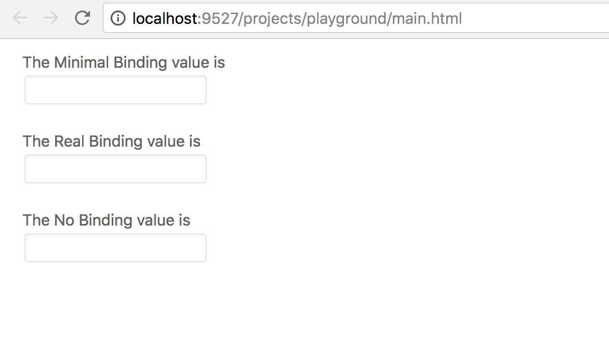

# Components usage guidelines

## First thing first

> In order to accomplish this tutorial, you need our project [setup](https://developer.pagefly.io/pagefly/app-installation) successfully to test codes if needed and a basic understand on [how an Element works](https://developer.pagefly.io/core/working-with-pagefly-elements) in our project. 
>
> NOTICE: We have created a project named `playground` for you, just run `yarn` then `yarn play` in case you might need to replace the code in its main view to test the code.

Our components work like an UI Library, which means you can import them to use inside our project. They are included _mainly_ in the `Inspector` or `Module` **NOT** in the `Element render method`. It's possible to add UI Components in there but we avoid doing so since the purpose of UI Components is to modify Element data which affects Element render method, an infinite loop might be triggered if your code is composed loosely. By the way, be aware of what you're doing if you really need to do so.

In most cases, when you build an `Element` \(For instance: Heading\), you need to define its `Inspector`, too. In the `Inspector`, there should be some `value updaters` \(For example: text inside the heading\). As the `Inspector` takes your `Element` inspector returned value which includes views to render, you can fully customize your `Element's Inspector` views or just simply use the pre-built UI Components.Let's take a closer look on how you should do with your `Element's Inspector`

I'll take `Heading Element` as example so please replace the `Heading` get inspector code with below codes to see the result



```jsx
// Assume that you have successfully run our project
// Before UI Components
get inspector() { 
    return {
        general: { 
            settings: <input value={this.state.text} onChange={e => { 
                    this.saveState({ _title: { text: e.target.value }}) 
            }} /> 
        } 
    }
}
// You probably need to add styles to your input
// ====== //
// After UI Components
get inspector() { 
    return { 
        general: { settings: <UI.Input target={this._text} bind="state.text" /> } 
    }
}
// it's beautifully styled, add more styles when needed only
```



## Let's get started

> Alright, now you probably have an overview of what are UI Components, we will go deeper in how to use them properly. Basically, there are 3 main types of our UI Components: Controls, Fields and General Components \(based on the complexity level of its construction\).

### UI Controls - The materials

> There are plenty of them, but all is built to modify a datasource. It could be Element data known as state or model, or it could be some other modules' state.

#### The core concept

All UI Controls such as `UIInput`, `UISwitch`, `UISlider`, ... extends `UIControl`. Rather than just styling, it provides a powerful binding mechanism. 

Let's take a look at the `SoundCloud` Element below



```jsx
// without binding mechanism
get inspector() {
    const inspector = super.inspector
    return {
        ...inspector,
        general: {
            content: (
                <UIGroup>
                    <UIField label="Soundcloud URL" vertical>
                        // you need to control your SoundCloud src state here
                        <UIInput value={this.state.src} onChange={value => {
                            this.saveState({ src: value })
                        }} placeholder="Enter Soundcloud URL..." />
                    </UIField>
                </UIGroup>
            )
        }
    }
}
// With binding mechanism
get inspector() {
    const inspector = super.inspector
    return {
        ...inspector,
        general: {
            content: (
                <UIGroup>
                    <UIField label="Soundcloud URL" vertical>
                        // the src state of SoundCloud is automatically handled with binding system
                        // its output is the same with the above method
                        // but you will not need to waste some lines of code
                        <UIInput bind="state.src" placeholder="Enter Soundcloud URL..." />
                    </UIField>
                </UIGroup>
            )
        }
    }
}

```



At its core, binding mechanism saves your coding time, **a lot of time**. If your `Element` has one or two values to update, there will be no significant difference between using React way or binding mechanism. But if your `Element` has plenty of values to adjust, you will desperately want to use binding mechanism instead. Besides, if you're curious about how binding mechanism works, please refers to `UIControl.js` and `Element.js`.

NOTICE: The good news is that you can modify `Element` datasource just in a blink of an eye. The bad news is that the binding mechanism works only with `Element` in our project, currently.

#### Apply binding mechanism

> We create a playground as a minimal working project to give you examples to practice.

After successfully setup `pfapp` project, run yarn play and open `main.html` with your browser. Let's take a closer look at the `main.html` file and please gracefully read my comment.



```markup
<!DOCTYPE html>
<title>PageFly App</title>
<link rel="stylesheet" href="https://cdnjs.cloudflare.com/ajax/libs/font-awesome/4.7.0/css/font-awesome.min.css"/>
<div id="app"></div>
<!-- IMPORTANT: 1.3.2 is the pfapp version, it should match package.json version-->
<script src="dist/core/1.3.2/main.js"></script>

```



Replace the code in `views/index.js` file with the `index.js` file below. The view in your browser should reflect the changes, 3 inputs should appear. Try typing some letters in those inputs and notice the changes in the title above them.



The value above the input should be the same with the input value, for all those 3 different ways. We will go deeper into the code to see how they are composed.



```jsx
import UIApp from 'components/ui/providers/UIApp'
import { MinimalBindingElement, RealBindingElement, NoBindingElement } from '../examples/binding'

export default class extends Component {
	render() {
		return (
			<UIApp>
				<MinimalBindingElement />
				<RealBindingElement />
				<NoBindingElement />
			</UIApp>
		)
	}
}
```



```jsx
import UIView from 'components/UIVIew'

export class MinimalBindingElement extends React.Component {
	constructor(props) {
		super(props)
		this.state = {}
		this.model = new Model(this.state)
		this.model.on('change', m => {
			this.setState(m.toJSON())
		})
	}
	render() {
		return (
			<Wrapper>
				<div>The Minimal Binding value is {this.state.value}</div>
				<UI.Input target={this.model} bind={'value'} />
			</Wrapper>
		)
	}
}

export class RealBindingElement extends UIView {
	render() {
		return (
			<Wrapper>
				<div>The Real Binding value is {this.state.value}</div>
				<UI.Input target={this} bind={'state.value'} />
			</Wrapper>
		)
	}
}

export class NoBindingElement extends React.Component {
	state = {
		value: ''
	}
	render() {
		return (
			<Wrapper>
				<div>The No Binding value is {this.state.value}</div>
				<UI.Input
					value={this.state.value}
					onChange={value => {
						this.setState({ value })
					}}
				/>
			</Wrapper>
		)
	}
}

const Wrapper = styled.div`
	margin: 10px 20px;
`

```



In `binding.js`, the `MinimalBindingElement` represents the minimal version of our binding mechanism. Inside the element, there is a Backbone model. When changes are made in `UIControl` \(here is `UIInput`\), there is an event triggered by that model which is taken as target props \(please refers to `UIControl` at set value method\). In the `MinimalBindingElement` listens to that event in its constructor then set the state with the new value taken from the model.

The `RealBindingElement` represents the full version of our binding mechanism. The `target` props in `UIInput` now is this instead of `this.model` and the `RealBindingElement` extends the `UIView` instead of `React.Component`. In `UIView`, we apply the same thing to what the `MinimalBindingElement` does but in a very thoughtful and optimized way. Basically, it gives the target a model then add a listener in its constructor so that its inherited instances are updated after the model value is changed.

Lately, `NoBindingElement` represents the React way of modifying a component value. It perfectly satisfies the requirement in term of performance. It's just a bit longer.

_What you will actually do in our project_

Please look back to the `RealBindingElement`, you need to define the `target` and the `bind` `props`. If you use the `UIControls` inside `get` `inspector` of `Element`, the default target will be that `Element` and you do not need to define it. But if the target is different \(scroll up to the `Heading.js`\), please do add it.

The bind value is subtle, if you want to set value to the `state` please add state at the beginning of the string \(for instance: `"state.value", "state.selectedNumber", "state.isReal"`, ...\) . We do support `style` binding, so, if you want to bind the value to the element `style`, please add `style` at the beginning of the string \(for example: `"style.color", "style.fontSize", "style.margin"`, ...\)

Want to try? Replace the code in `views/index.js` with the code below



```jsx

import UIApp from 'components/ui/providers/UIApp'
import SideBar from 'modules/sidebar'
import DrawerNavigator from 'modules/DrawerNavigator'
import Workspace from 'modules/workspace'
import Inspector from 'modules/inspector'

export default class extends Component {
	render() {
		return (
			<UIApp>
				<UI.Layout>
					<SideBar />
					<DrawerNavigator />
					<Workspace />
					<Inspector />
				</UI.Layout>
			</UIApp>
		)
	}
}

```



Open the `Paragraph.js` in `pfapp/common/elements/Paragraph/Paragraph.js` then modify its inspector. Open the main.html with your browser, add a Paragraph from the side bar to page, take a look at the right panel, navigate to the General tab you should see the Paragraph inspector view. Follow my comments below 

```javascript
// Find this code in Paragraph inspector
<UIField label="Text" target={this._text} vertical>
// change the bind value to "style.color", 
	<UIInput type="textarea" bind="state.text" />
</UIField>
// Now wait for the building process completed, get back to your browser
// type red in the text area box in the inspector and notice the change
```

You can spend more time to play with `Paragraph` or build your own `Element` inspector view, instead. As we have stated above, there are many UI Controls. To make it easy for you to start, we take `UIInput` as example. Other UI Controls might has more props than just target and bind. Like `UISlider` allows you to customize the max and min value. By the way, you should go to the UI Controls that you want to use, read the code to see how to use them properly. We have explained the core thing that all the UI Controls have, now it's your time to hack. 

_What if you do not want to use binding mechanism_

UI Controls work flawlessly without binding, please add props `value` and `onChange` to the UI Controls you use then manually do things you want. One small thing, `onChange` gives you the value not the `React event`.

NOTICE: Both UI.Input and UIInput are the same. You can use `UI.Input` in your `Element` without import it since `UI` is a global variable, if you use `UIInput` instead \(without the dot\), you will need to import it first.

### UI Widgets - The flyers

> UI Widgets are floated components. For instance: `UIPopup` provides a popup or `UIModal` provides a modal.

#### The core concept

All the widgets are built with one and only single purpose which is shortening the time spending on a repeated task. You can use `MPopup` in any other components if you want to make it function in a popup view. That's pretty handy as it saves your time of coding your version of popup.

#### Using UI Widgets

You're likely to use it when you're building a new UI Widgets or Modules. To reuse any UI Widgets, make sure you understand it thoroughly. It's an advanced part of your coding journey, be aware of how you are going to compose your component as it might cause you more troubles than helps if you don't get it right. Basically, UI Widgets provide you a React component so just import and use it. It's crucial to be thoughtful anytime you want to use UI Widgets. Let's think _how come_ before you consider _how_.

**NOTICE:** UI Fields work pretty much like UI Widgets, they have UI Controls inside to proceed a given task. Though, they are two different types of our components.

### UI Layouts - The builders

#### The core concept

UI Layout helps you form an intuitive view regardless of your css level. Once again, it reduces your UI designing time by giving you options. Cool enough? Let's rock.

#### UI Layout usage

It appears almost everywhere in our project especially in Modules and Inspector. For example: `FontsManager`, `TemplatePicker`, `QRCode`, ...



```jsx
get inspector() {
	const inspector = super.inspector
	return {
		...inspector,
		general: {
			...inspector.general,
			content: (
				<UIGroup name="Content">
					<UIField label="Content" vertical>
						<UIInput type="textarea" bind="state.data" />
					</UIField>

					<UIField label="Alt Text" vertical>
						<UIInput type="textarea" bind="state.alt" />
					</UIField>
					<UIField label="Dimensions">
						<UIButtons>
							<UISlider bind="state.size" min={10} max={500} step={2} flex="4" />
							<UIInput bind="state.size" min="10" max="500" step="2" flex="1" />
						</UIButtons>
					</UIField>
				</UIGroup>
			)
		},
		styling: null,
		advanced: null
	}
}
```



```jsx
export default function FontsManager() {
	return (
		<Subscribe to={[FontManagerContainer]}>
			{container => {
				return (
					<UI.Modal
						width={700}
						height={500}
						open={container.state.open}
						onClickOutside={() => container.setState({ open: false })}
					>
					// primary props is passed to tell the Header changes its style
					// to the corresponding style and content is the title of Header
						<UI.Layout.Header primary content="Fonts Manager" />
					// using UI.Layout here makes 3 children inside placed on 
					// the same line by default 
						<UI.Layout>
							<FontsFilters fontContainer={container} />
							<List />
							<Detail />
						</UI.Layout>
					</UI.Modal>
				)
			}}
		</Subscribe>
	)
}

```



```jsx
export default function TemplatesPreview(props) {
	return (
		<UI.Layout.Main flex="1">
			{props.selectedTemplateId >= 0 ? (
				<UI.Layout.Nav style={{ padding: '10px 20px' }}>
					<div>
						<UI.Select
							type="menu"
							onChange={value => {
								props.setDevice(value)
							}}
							value={props.selectedDevice}
							options={[
								{ icon: 'television', value: 'all', on: 'all' },
								{ icon: 'laptop', value: 'laptop', on: 'laptop' },
								{ icon: 'tablet', value: 'tablet', on: 'tablet' },
								{ icon: 'mobile', value: 'mobile', on: 'mobile' }
							]}
							size="xl"
						/>
					</div>
					<UI.Button
						target={this}
						size="xl"
						primary
						label="Start with this template"
						onClick={() => {
							console.log('select template', props)
							onApply(props, props.selectedTemplateData)
						}}
					/>
				</UI.Layout.Nav>
			) : null}
			{props.selectedTemplateData ? (
				<HTMLPreviewer type="template" srcDoc={props.previewHtml} device={props.selectedDevice} />
			) : (
				<Placeholder />
			)}
		</UI.Layout.Main>
	)
}

```



They are `UIField`, `UIGroup` in Inspector or `UILayout` in modules `render` method. Now take a closer look at the `FontsManager`, then read the comments in render method. Eventually, to design a tuning view, all you need to do is reading the supported props inside the UI Layout components which meet your needs.

## Further steps

It's important to understand how an UI Component works but it's even more important to be clear about the core concept. Implementations might be updated anytime but the concept might not be that easy. That's why we do not focus much on explaining how things work under the hood. What's more? It's your turn now to dig deeper into UI Components code and hack them your way. Good luck.

