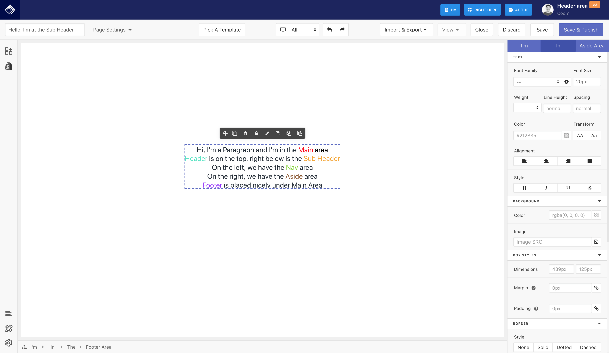
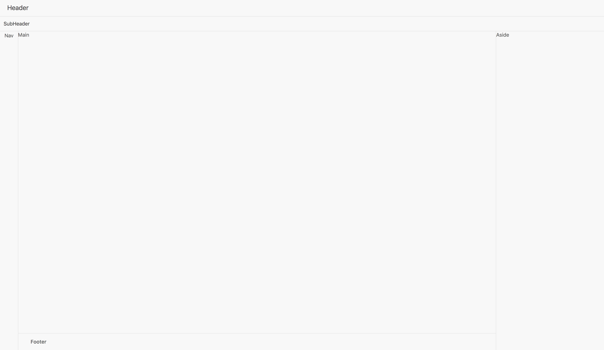

# Designing views using UI Layouts

## Overview

You are likely to see the most common layout here, only, as we can not show you how to build every single pieces of it. Instead, we will focus on the disciplines to build them showed in the below examples.

## Examples

### Building PageFly layout

Please look at the picture below to see how PageFly app looks like.



  
You should soon recognize 6 main areas: `Header, Sub Header, Nav, Main, Aside, Footer`. Now we will construct this layout using `UILayout`. Basically, `UILayout` has 2 main props: `vertical` and `flex`. If you add vertical props, the `UILayout` will place all its children in `vertical` order, otherwise, all items inside `UILayout` will be horizontal by default. About the `flex`, please refers to [this](https://www.w3schools.com/cssref/css3_pr_flex.asp) to understand what it is and the values you can assign to.

Right below is the code of our app layout. Please replace `pfapp/projects/playground/views/index.js` with it then run `yarn play`.



```jsx
import UIApp from 'components/ui/providers/UIApp'
import UI from 'components'

export default class extends Component {
	render() {
		return (
			<UIApp>
				<UI.Layout vertical>
					<UI.Layout.Header>Header</UI.Layout.Header>
					<UI.Layout.SubHeader flex="0 0 40px">SubHeader</UI.Layout.SubHeader>
					<UI.Layout>
						<UI.Layout.Nav flex="0 0 50px">Nav</UI.Layout.Nav>
						<UI.Layout vertical>
							<UI.Layout.Main flex="auto">Main</UI.Layout.Main>
							<UI.Layout.Footer>Footer</UI.Layout.Footer>
						</UI.Layout>
						<UI.Layout.Aside flex="0 0 300px">Aside</UI.Layout.Aside>
					</UI.Layout>
				</UI.Layout>
			</UIApp>
		)
	}
}
```



You will see the result like this if you're doing it right.



## Step back

You've vividly observed the nature of UI Layouts, it's essential to dig a little deeper into the code base. We surely hope you understand the purpose of constructing UI Layouts for later usage but more than just that, we want you to gradually form your layout logical thinking. 

Like if you want to have 3 columns in a row, it's recommended to have a section and a row as wrappers outside the 3 columns styled with flex or float attributes instead of adding a fixed margin or padding to 3 div blocks \(even it might seem quicker\). 

Besides, we also want you to contribute to the UI Layouts system so that it becomes more and more intuitive and easy for starters to use. Embrace the smart laziness!

