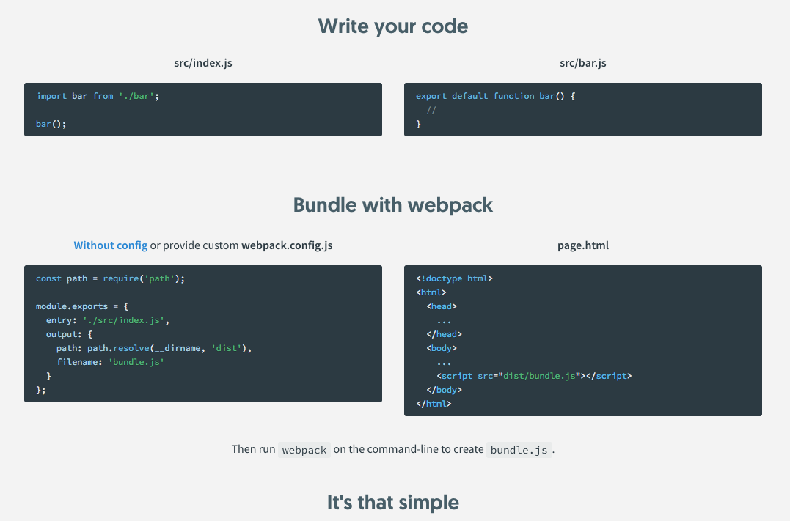

# Tools used in PageFly

## Webpack




####  Entry

In each project from PageFly, we will have an entry to start:

```javascript
module.exports = {
  entry: 'entry.js'
};
```

#### Output

Output of PageFly's projects will be the `dist` folder inside the project:

```javascript
module.exports = {
  output: {
    path: path.resolve(TARGET, './dist'),
    filename: `core/${VERSION}/[name].js`,
    chunkFilename: `chunk/${VERSION}/[name].chunk.js`
  }
};
```

#### Resolvers

```javascript
module.exports = {
  resolve: {
  // This is how Files in `projects` can override `common`
    modules: [
      ...(DIR ? [path.resolve(TARGET, './'), path.resolve(TARGET, './components'), ...scandir(${TARGET}./components)] : []),
      path.resolve(__dirname, './common'),
      path.resolve(__dirname, './node_modules')
    ],
    // This is how Files in `elements` folder can be named without index.js
    plugins: [
      new DirectoryNamedWebpackPlugin({ transformFn(dirname) { let match if ((match = dirname.match(/^elements\/(+)$/))) { const name = match[1] return ${dirname}/${name}.js } return dirname } })
    ]
  }
};
```

#### Loaders

Loaders used in PageFly:

* [babel-loader](https://github.com/babel/babel-loader): Load JavaScript files.
* [style-loader](https://github.com/webpack-contrib/style-loader): Add CSS to DOM
* [css-loader](https://github.com/webpack-contrib/css-loader): Load CSS files
* [postcss-loader](https://github.com/postcss/postcss-loader): Cross browser CSS support
* [file-loader](https://github.com/webpack-contrib/file-loader): Load others files

#### Plugins

Plugins used in PageFly:

* [DefinePlugin](https://webpack.js.org/plugins/define-plugin/): Define global variable at build time
* [WebpackBar](https://github.com/nuxt/webpackbar): Show build progress
* [ProvidePlugin](https://webpack.js.org/plugins/provide-plugin/): Provide global modules
* [ExtractTextPlugin](https://github.com/webpack-contrib/extract-text-webpack-plugin): Generate CSS file.
* [UglifyJSPlugin](https://github.com/webpack-contrib/uglifyjs-webpack-plugin): Minify JavaScript
* [MinChunkSizePlugin](https://webpack.js.org/plugins/min-chunk-size-plugin/)
* [SWPrecacheWebpackPlugin](https://github.com/goldhand/sw-precache-webpack-plugin)
* [IgnorePlugin](https://webpack.js.org/plugins/ignore-plugin/)


## Babel

## ESLint + Prettier


